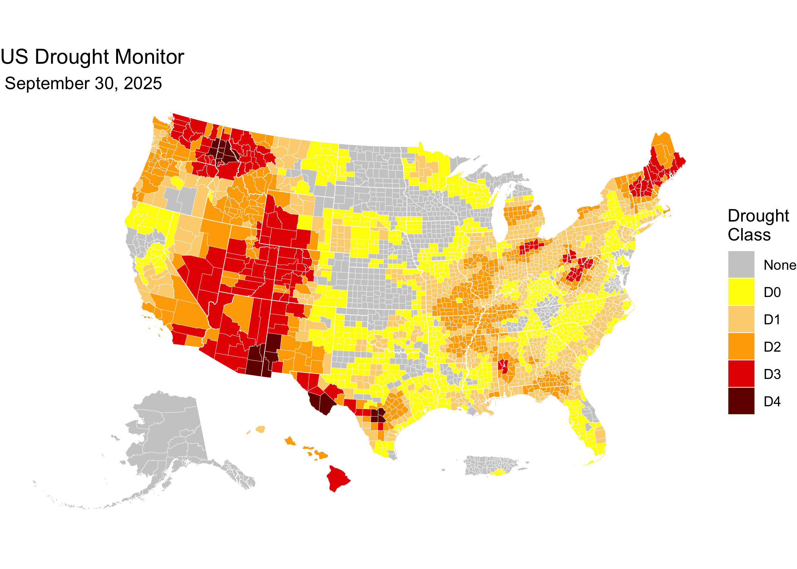

<!-- README.md is generated from README.Rmd. Please edit that file -->

[](https://github.com/sustainable-fsa/usdm-counties-fsa-lfp/)


This repository is an archive weekly US Drought Monitor (USDM) data
aggregated to the county level as reported by the USDM.

<a href="https://sustainable-fsa.github.io/usdm-counties-fsa-lfp/manifest.html" target="_blank">📂
View the US Drought Monitor county aggregation archive listing here.</a>

The county data archived in this repository were acquired via API
request by R. Kyle Bocinsky (Montana Climate Office) and are updated
weekly. API documentation is available at
<a href="https://droughtmonitor.unl.edu/DmData/DataDownload/WebServiceInfo.aspx" target="_blank">.

Here is a template of the call used to retrieve these data:

`https://usdmdataservices.unl.edu/api/CountyStatistics/GetDroughtSeverityStatisticsByAreaPercent?aoi=AK,AL,AR,AZ,CA,CO,CT,DC,DE,FL,GA,HI,IA,ID,IL,IN,KS,KY,LA,MA,MD,ME,MI,MN,MO,MS,MT,NC,ND,NE,NH,NJ,NM,NV,NY,OH,OK,OR,PA,PR,RI,SC,SD,TN,TX,UT,VA,VT,WA,WI,WV,WY&startdate=01/04/2000&enddate=01/04/2000&statisticsType=2`

------------------------------------------------------------------------

## 📈 About the US Drought Monitor (USDM)

The US Drought Monitor is a weekly map-based product that synthesizes
multiple drought indicators into a single national assessment. It is
produced by:

- National Drought Mitigation Center (NDMC)
- US Department of Agriculture (USDA)
- National Oceanic and Atmospheric Administration (NOAA)

Each weekly map represents a combination of data analysis and expert
interpretation.

The USDM weekly maps depicting drought conditions are categorized into
six levels:

- **None**: Normal or wet conditions
- **D0**: Abnormally Dry
- **D1**: Moderate Drought
- **D2**: Severe Drought
- **D3**: Extreme Drought
- **D4**: Exceptional Drought

While USDM drought class boundaries are developed without regard to
political boundaries, it is often aggregated by political boundaries to
assist in decision-making and for regulatory purposes.

> **Note**: This archive is maintained by the Montana Climate Office,
> but all analytical authorship of the USDM drought maps belongs to the
> named USDM authors.

------------------------------------------------------------------------

## 🗂 Directory Structure

- `usdm-counties-reported.R`: R script that downloads weekly USDM data
  aggregated to county boundaries.
- `usdm-counties-reported.parquet`: Processed county-level USDM data in
  a single parquet file.
- `data/`: Directory containing processed county-level USDM data.
- `README.Rmd`: This README file, providing an overview and usage
  instructions.

------------------------------------------------------------------------

## 📍 Quick Start: Visualize a Weekly County USDM Map in R

This snippet shows how to load a weekly GeoParquet file from the archive
and create a simple drought classification map using `sf` and `ggplot2`.

``` r
# Load required libraries
library(arrow)
library(sf)
library(ggplot2) # For plotting
library(tigris)  # For state boundaries
library(rmapshaper) # For innerlines function

## Get latest USDM data
latest <-
  jsonlite::fromJSON(
    "manifest.json"
  )$path |>
  stringr::str_subset("parquet") |>
  stringr::str_subset("data/usdm") |>
  max()
# e.g., [1] "data/usdm/USDM_2025-05-27.parquet"

date <-
  latest |>
  stringr::str_extract("\\d{4}-\\d{2}-\\d{2}") |>
  lubridate::as_date()

# Get the highest (worst) drought class in each county
usdm <-
  latest |>
  arrow::read_parquet() |>
  dplyr::group_by(STATEFP, COUNTYFP) |>
  dplyr::filter(usdm_class == max(usdm_class))

## Load the US Census county data
counties <- 
  tigris::counties(cb = TRUE, 
                   year = 2020,
                   resolution = "5m") |>
  dplyr::filter(!(STATEFP %in% c("60", "66", "69", "78"))) |>
  # transform to WGS 84
  sf::st_transform("EPSG:4326") |>
  sf::st_cast("POLYGON", warn = FALSE, do_split = TRUE) |>
  tigris::shift_geometry() |>
  dplyr::group_by(STATEFP, COUNTYFP) |>
  dplyr::summarise(.groups = "drop") |>
  sf::st_cast("MULTIPOLYGON")
```

    ##   |                                                                              |                                                                      |   0%  |                                                                              |=                                                                     |   1%  |                                                                              |=                                                                     |   2%  |                                                                              |==                                                                    |   2%  |                                                                              |==                                                                    |   3%  |                                                                              |===                                                                   |   4%  |                                                                              |===                                                                   |   5%  |                                                                              |====                                                                  |   6%  |                                                                              |=====                                                                 |   7%  |                                                                              |=====                                                                 |   8%  |                                                                              |======                                                                |   8%  |                                                                              |======                                                                |   9%  |                                                                              |=======                                                               |  10%  |                                                                              |========                                                              |  11%  |                                                                              |========                                                              |  12%  |                                                                              |=========                                                             |  13%  |                                                                              |==========                                                            |  14%  |                                                                              |==========                                                            |  15%  |                                                                              |===========                                                           |  16%  |                                                                              |============                                                          |  17%  |                                                                              |=============                                                         |  18%  |                                                                              |=============                                                         |  19%  |                                                                              |==============                                                        |  20%  |                                                                              |===============                                                       |  21%  |                                                                              |===============                                                       |  22%  |                                                                              |================                                                      |  23%  |                                                                              |=================                                                     |  24%  |                                                                              |==================                                                    |  25%  |                                                                              |==================                                                    |  26%  |                                                                              |===================                                                   |  27%  |                                                                              |====================                                                  |  28%  |                                                                              |====================                                                  |  29%  |                                                                              |=====================                                                 |  30%  |                                                                              |======================                                                |  31%  |                                                                              |======================                                                |  32%  |                                                                              |=======================                                               |  33%  |                                                                              |========================                                              |  34%  |                                                                              |=========================                                             |  35%  |                                                                              |=========================                                             |  36%  |                                                                              |==========================                                            |  37%  |                                                                              |===========================                                           |  38%  |                                                                              |===========================                                           |  39%  |                                                                              |============================                                          |  40%  |                                                                              |=============================                                         |  41%  |                                                                              |=============================                                         |  42%  |                                                                              |==============================                                        |  42%  |                                                                              |==============================                                        |  43%  |                                                                              |===============================                                       |  44%  |                                                                              |===============================                                       |  45%  |                                                                              |================================                                      |  45%  |                                                                              |================================                                      |  46%  |                                                                              |=================================                                     |  47%  |                                                                              |=================================                                     |  48%  |                                                                              |==================================                                    |  48%  |                                                                              |==================================                                    |  49%  |                                                                              |===================================                                   |  50%  |                                                                              |====================================                                  |  51%  |                                                                              |====================================                                  |  52%  |                                                                              |=====================================                                 |  52%  |                                                                              |=====================================                                 |  53%  |                                                                              |======================================                                |  54%  |                                                                              |======================================                                |  55%  |                                                                              |=======================================                               |  55%  |                                                                              |=======================================                               |  56%  |                                                                              |========================================                              |  57%  |                                                                              |========================================                              |  58%  |                                                                              |=========================================                             |  58%  |                                                                              |=========================================                             |  59%  |                                                                              |==========================================                            |  59%  |                                                                              |==========================================                            |  60%  |                                                                              |==========================================                            |  61%  |                                                                              |===========================================                           |  61%  |                                                                              |===========================================                           |  62%  |                                                                              |============================================                          |  62%  |                                                                              |============================================                          |  63%  |                                                                              |=============================================                         |  64%  |                                                                              |=============================================                         |  65%  |                                                                              |==============================================                        |  65%  |                                                                              |==============================================                        |  66%  |                                                                              |===============================================                       |  67%  |                                                                              |===============================================                       |  68%  |                                                                              |================================================                      |  68%  |                                                                              |================================================                      |  69%  |                                                                              |=================================================                     |  69%  |                                                                              |=================================================                     |  70%  |                                                                              |=================================================                     |  71%  |                                                                              |==================================================                    |  71%  |                                                                              |==================================================                    |  72%  |                                                                              |===================================================                   |  72%  |                                                                              |===================================================                   |  73%  |                                                                              |===================================================                   |  74%  |                                                                              |====================================================                  |  74%  |                                                                              |====================================================                  |  75%  |                                                                              |=====================================================                 |  75%  |                                                                              |=====================================================                 |  76%  |                                                                              |======================================================                |  76%  |                                                                              |======================================================                |  77%  |                                                                              |======================================================                |  78%  |                                                                              |=======================================================               |  78%  |                                                                              |=======================================================               |  79%  |                                                                              |========================================================              |  79%  |                                                                              |========================================================              |  80%  |                                                                              |========================================================              |  81%  |                                                                              |=========================================================             |  81%  |                                                                              |=========================================================             |  82%  |                                                                              |==========================================================            |  83%  |                                                                              |===========================================================           |  84%  |                                                                              |============================================================          |  85%  |                                                                              |============================================================          |  86%  |                                                                              |=============================================================         |  87%  |                                                                              |==============================================================        |  88%  |                                                                              |==============================================================        |  89%  |                                                                              |===============================================================       |  90%  |                                                                              |================================================================      |  91%  |                                                                              |================================================================      |  92%  |                                                                              |=================================================================     |  93%  |                                                                              |==================================================================    |  94%  |                                                                              |==================================================================    |  95%  |                                                                              |===================================================================   |  95%  |                                                                              |===================================================================   |  96%  |                                                                              |====================================================================  |  97%  |                                                                              |===================================================================== |  98%  |                                                                              |===================================================================== |  99%  |                                                                              |======================================================================| 100%

``` r
usdm_counties <-
  usdm |>
  dplyr::left_join(counties) |>
  sf::st_as_sf()

# Plot the map
ggplot(counties) +
  geom_sf(data = sf::st_union(counties),
          fill = "grey80",
          color = NA) +
  geom_sf(data = usdm_counties,
          aes(fill = usdm_class), 
          color = NA) +
  geom_sf(data = rmapshaper::ms_innerlines(counties),
          fill = NA,
          color = "white",
          linewidth = 0.1) +
  geom_sf(data = counties |>
            dplyr::group_by(STATEFP) |>
            dplyr::summarise() |>
            rmapshaper::ms_innerlines(),
          fill = NA,
          color = "white",
          linewidth = 0.2) +
  scale_fill_manual(
    values = c("grey80",
               "#ffff00",
               "#fcd37f",
               "#ffaa00",
               "#e60000",
               "#730000"),
    drop = FALSE,
    name = "Drought\nClass") +
  labs(title = "US Drought Monitor",
       subtitle = format(date, " %B %d, %Y")) +
  theme_void()
```



------------------------------------------------------------------------

## 📝 Citation & Attribution

**Citation format** (suggested):

> US Drought Monitor authors and R. Kyle Bocinsky YYYY. *Archive of US
> Drought Monitor Weekly Maps Aggregated to County Boundaries as
> Reported by the US Drought Monitor*. Data processed, curated, and
> archived by R. Kyle Bocinsky, Montana Climate Office. Accessed via
> GitHub archive, YYYY-MM-DD.
> <https://sustainable-fsa.github.io/usdm-counties-fsa-lfp/>

**Acknowledgments**:

- Map content and data processing by USDM authors.
- Data curation and archival structure by R. Kyle Bocinsky, Montana
  Climate Office, University of Montana.

------------------------------------------------------------------------

## 📄 License

- **Raw USDM data** (NDMC): Public Domain (17 USC § 105)
- **Processed data & scripts**: © R. Kyle Bocinsky, released under
  [CC0](https://creativecommons.org/publicdomain/zero/1.0/) and [MIT
  License](./LICENSE) as applicable

------------------------------------------------------------------------

## ⚠️ Disclaimer

This dataset is archived for research and educational use only. The
National Drought Mitigation Center hosts the US Drought Monitor. Please
visit <https://droughtmonitor.unl.edu>.

------------------------------------------------------------------------

## 👏 Acknowledgment

This project is part of:

**[*Enhancing Sustainable Disaster Relief in FSA
Programs*](https://www.ars.usda.gov/research/project/?accnNo=444612)**  
Supported by USDA OCE/OEEP and USDA Climate Hubs  
Prepared by the [Montana Climate Office](https://climate.umt.edu)

------------------------------------------------------------------------

## 📬 Contact

**R. Kyle Bocinsky**  
Director of Climate Extension  
Montana Climate Office  
📧 <kyle.bocinsky@umontana.edu>  
🌐 <https://climate.umt.edu>
